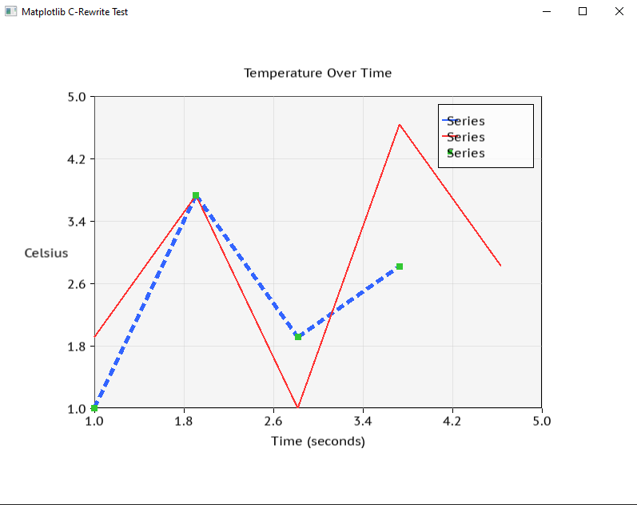

# SDL_graphs 📈

A lightweight, C-based graphing library for **SDL3**, designed to bring the simplicity and aesthetics of **Matplotlib** to low-level systems programming.

---

## 🚀 Key Features

* **Proportional Layouts**: Graphs automatically scale and adjust when the window is resized.
* **Matplotlib Aesthetics**: Clean gray backgrounds, customizable grid lines, and classic axis padding.
* **Multiple Plot Types**: 
    * `plot()`: For continuous line graphs.
    * `scatter()`: For discrete data points with customizable markers.
* **Deep Customization**:
    * Adjust line thickness and styles (Solid, Dashed, Dotted).
    * Automatic axis scaling and numerical labeling.
    * Built-in Legend support with auto-labeling.
    * Axis titles (`xlabel`, `ylabel`) and main figure titles.

---

## 🛠 Build Instructions

### Prerequisites
* [SDL3](https://github.com/libsdl-org/SDL)
* [SDL3_ttf](https://github.com/libsdl-org/SDL_ttf)
* CMake 3.10+
* A C compiler (GCC, Clang, or MSVC)

### Compiling
Since this library relies on local paths for SDL3, use the following CMake commands to point to your library installations:
For me it was
cmake -B build -DSDL3_DIR="D:/libs/SDL3-3.4.0/x86_64-w64-mingw32" -DSDL3_TTF_DIR="D:/libs/SDL3_ttf-3.2.2/x86_64-w64-mingw32"
cmake --build build

```bash
# 1. Configure the build
cmake -B build \
  -DSDL3_DIR="C:/Path/To/SDL3" \
  -DSDL3_TTF_DIR="C:/Path/To/SDL3_ttf"

# 2. Build the project
cmake --build build
```

## 📚 Function Reference

### Figure & Layout Management
Functions for initializing the window context and ensuring the plot remains responsive to window resizing.

| Function | Description |
| :--- | :--- |
| `subplots(title, w, h, num_axes)` | Initializes a `Figure` with a resizable SDL window, renderer, and specify number of `Axes`. |
| `update_layout(fig, w, h)` | Recalculates margins and axes sizes. Call this whenever an `SDL_EVENT_WINDOW_RESIZED` event occurs. |


---

### Plotting Data
The core functions for injecting data into your visualization.

#### `plot(ax, x, y, count, color)`
Adds a line series to the specified axes.
* **ax**: Pointer to the target `Axes`.
* **x/y**: Arrays of floats. (Note: The library stores pointers; do not free data while rendering).
* **count**: Number of points in the arrays.
* **color**: `SDL_Color` for the line.

#### `scatter(ax, x, y, count, color, size)`
Adds a point-based series (markers).
* **size**: The diameter of the marker in pixels.

---

### Aesthetics & Customization
Tailor the metadata and visual style of your graph.

#### **Labels & Titles**
These functions define the text metadata. They store pointers to your strings for efficiency.

* `set_title(ax, title)`: Sets the main heading at the top center.
* `set_xlabel(ax, label)`: Sets the horizontal axis description (appears below the axis).
* `set_ylabel(ax, label)`: Sets the vertical axis description (appears left of the axis).
* `set_label(ax, index, name)`: Sets the name for a specific data series for use in the legend (max 31 chars).


#### **Styling Toggles**
* `set_grid(ax, enabled)`: Toggles the background grid. Requires Alpha Blending enabled on the renderer.
* `set_legend(ax, enabled)`: Toggles the series information box.
* `set_linestyle(ax, index, style)`: Changes a series stroke pattern.
    * Options: `STYLE_SOLID`, `STYLE_DASHED`, `STYLE_DOTTED`.


---

### Advanced Geometry (Internal Utilities)
These functions handle the heavy lifting of the rendering pipeline.

* **`render_axes(renderer, font, ax)`**
    The main internal draw call. It handles the coordinate transformation from data-space to pixel-space and renders all layers.
* **`RenderThickLine(renderer, x1, y1, x2, y2, thickness)`**
    Uses `SDL_RenderGeometry` to create a rectangle from two triangles, allowing for lines wider than 1 pixel.
* **`DrawDashedThickLine(renderer, x1, y1, x2, y2, thickness, style)`**
    Combines trigonometric stepping with geometric rendering to create patterned lines with custom thickness.


---

### Quick Start Example
```c
// Create a 800x600 window
Figure* fig = subplots("Live Telemetry", 800, 600,1);

// Customize the look
set_xlabel(fig->axes, "Time (s)");
set_ylabel(fig->axes, "Voltage (V)");
set_grid(fig->axes, true);

// Plot data (x_vals and y_vals are float arrays)
plot(fig->axes, x_vals, y_vals, 500, (SDL_Color){0, 255, 0, 255});
set_label(fig->axes, 0, "Battery A");